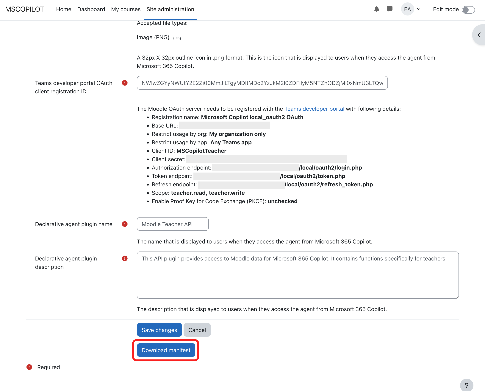
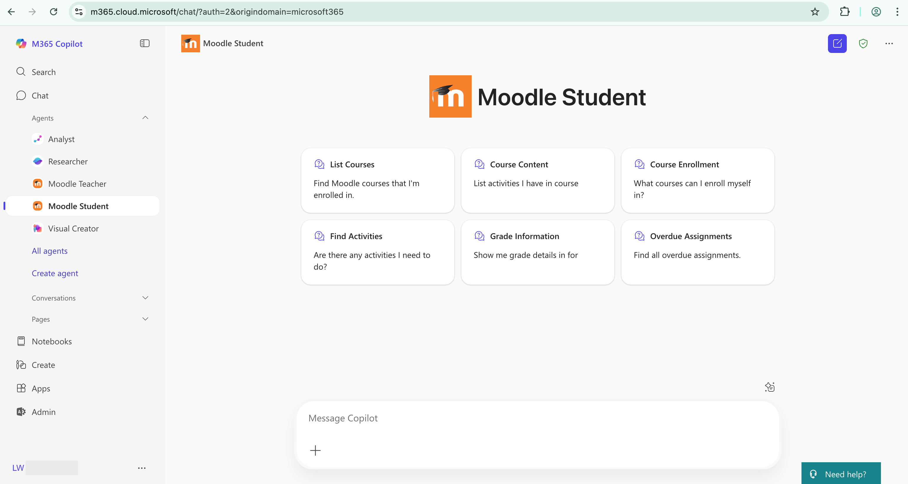

# Copilot Plugin and Agent Samples for Moodle

## Overview

This repository contains Moodle plugin and agent samples for Education to be used with [Microsoft 365 Copilot](https://www.microsoft.com/en-us/microsoft-365/copilot) and Microsoft 365 [Copilot Chat](https://www.microsoft.com/en-us/microsoft-365/copilot/try-copilot-chat). These agents are provided as [M365 Copilot extensibility](https://aka.ms/extend-copilot) and therefore should be used with its existing customer-facing documentation.

The M365 Copilot plugin (local_copilot) enables Moodle to integrate with M365 Copilot and Copilot Chat by providing declarative agents for teachers and students. This integration allows users to access and interact with Moodle data directly through Copilot across multiple M365 apps, enhancing productivity and providing quick access to course information, assignments, and other educational resources.

The samples demonstrate how customers can create or customize their own declarative agents for M365 Copilot that connect to the Moodle LMS. Creation, customization, deployment, administration, support, and maintenance of any declarative agent for M365 Copilot based on these samples is at the discretion of the customer, and the responsibility of the customer.

## Features

The plugin provides samples for two separate declarative agents:

### Moodle Teacher
Allows teachers to:
- List courses they're teaching
- View course content and structure
- Find activities of a certain type
- View assignments and student submissions
- Create new assignments
- Update course images
- Monitor student progress and grades
- Create a new announcement (news forum discussion)

### Moodle Student
Allows students to:
- List enrolled courses
- View course content and activities
- Find activities of a certain type
- Find activity completion and grade information
- View assignment details, including due dates and submission status
- Check grades
- Find courses available for self-enrollment
- Self-enroll in courses

The features provided by the declarative agents may be extended in future releases.

## Requirements

### Moodle
- Moodle 4.5.0 or higher
- PHP 8.1 or higher
- [local_oauth2 plugin](https://moodle.org/plugins/local_oauth2) installed and configured
- [webservice_restful plugin](https://moodle.org/plugins/webservice_restful) installed and enabled
- Admin permissions in Moodle

### Microsoft
- Microsoft 365 tenant with [custom app upload enabled](https://learn.microsoft.com/en-us/microsoftteams/platform/concepts/build-and-test/prepare-your-o365-tenant#enable-custom-teams-apps-and-turn-on-custom-app-uploading)
- Microsoft 365 A1, A3, or A5 license
- Agents work in Copilot Chat (both metered/no metered usage) and M365 Copilot, [learn more](https://learn.microsoft.com/en-us/microsoft-365-copilot/extensibility/prerequisites#agent-capabilities-for-microsoft-365-users)
- Admin permissions in the Microsoft 365 Admin Center or Teams Admin Center
- A [Microsoft 365 account for development](https://learn.microsoft.com/en-us/microsoftteams/platform/toolkit/tools-prerequisites#create-a-free-microsoft-365-developer-account)

## Plugin Installation

1. Download and install required Moodle plugins (local_oauth2 and webservice_restful) if they are not installed already
2. Download the plugin local_copilot from [GitHub](https://github.com/microsoft/moodle-local_copilot) or [Moodle plugin directory](https://moodle.org/plugins/local_copilot)
3. Extract the plugin into the `local/copilot` directory of your Moodle installation
4. Log in as an administrator and navigate to **Site Administration > Notifications** to complete the installation
5. Follow the plugin configuration steps outlined below

## Plugin Configuration

### 1. OAuth Configuration in Moodle

1. Navigate to **Site Administration > Server > OAuth2 Server > Manage OAuth clients**

2. Click **Add OAuth client** button to create OAuth client for teacher. Following instructions on the page:
    - **Client ID** needs to be a string without space
    - **Redirect URI**: use `https://teams.microsoft.com/api/platform/v1.0/oAuthRedirect`
    - **Scope**: Use default value provided
    - After saving the changes, a **Client secret** will be generated for the OAuth client

3. Do the same to create an OAuth client for student
4. There should be 2 clients for teacher and student separately after these steps

### 2. Register OAuth Client on Microsoft Teams Developer Portal

1. Go to [Microsoft Teams Developer Portal](https://dev.teams.microsoft.com), login as a Teams admin user when asked
2. From the top banner, turn off **New Developer Portal** if it's on. The settings we need are not available in the new portal yet

3. In the **Tools** menu, go to **OAuth client registration**

4. Click **New OAuth client registration** button or **Register client** button. You will need to create two OAuth client registrations, for teacher and student agents respectively
5. Fill in OAuth client details on the page:
    - **Registration name**: a name of your choice
    - **Base URL**: URL of the Moodle site
    - **Restrict usage by org**: My organization only
    - **Restrict usage by app**: Choose "Any Teams app" option for now
    - **Client ID**: Copy value from Moodle
    - **Client secret**: Copy value from Moodle
    - **Authorization endpoint**: `https://url.to.moodle/local/oauth2/login.php`
    - **Token endpoint**: `https://url.to.moodle/local/oauth2/token.php`
    - **Refresh endpoint**: `https://url.to.moodle/local/oauth2/refresh_token.php`
    - **Scope**: Copy value from Moodle. Note scopes are separated by commas on this page
    - **Enable Proof Key for Code Exchange (PKCE)**: unchecked
    - **Client password authentication method**: Request body parameters (default) 
6. After saving the changes, an **OAuth client registration ID** will be created. Note its value

7. Repeat the steps to create OAuth client registration ID for student

### 3. Copilot Plugin Basic Configuration in Moodle

1. Navigate to **Site Administration > Plugins > Local plugins > Microsoft 365 Copilot > Basic settings**
2. Click on **Check required settings** to verify and configure necessary prerequisites:
    - Enable web services
    - Enable RESTful protocol
    - Configure Microsoft 365 Copilot Web Services
    - Set appropriate capabilities for authenticated users
3. In the **Copilot OAuth clients** selector, select all OAuth clients to be used for Microsoft 365 Copilot integration
4. You may need to save changes on the page at this stage
5. After changes in the **Copilot OAuth clients** setting are saved, select the OAuth client to be used by teacher and students for authentication in the **Teacher OAuth client ID** and **Student OAuth client ID** settings
6. Save changes

## Agent Configuration in Moodle

### 1. Moodle Teacher agent

Navigate to **Site Administration > Plugins > Local plugins > Microsoft 365 Copilot > Configure teacher agent app**. Configure the following settings:

- Agent app external ID (use default unless you need multiple teacher apps)
- Agent app names and descriptions
- App version (format: major.minor.patch)
- Accent color (hexadecimal)
- Agent display name
- Agent description and instructions
- Upload color icon (192x192 PNG) and outline icon (32x32 PNG). Default icons are provided
- Fill the OAuth client registration ID created on Microsoft Teams Developer Portal in the **Teams developer portal OAuth client registration ID** field
- Provide declarative agent plugin details
- Configure optional agent capabilities and knowledge source

Save the configuration. Download the manifest file (app package zip file).

### 2. Moodle Student agent

Navigate to **Site Administration > Plugins > Local plugins > Microsoft 365 Copilot > Configure student agent app**. Configure similar settings as for the teacher agent, with appropriate values for student users. Save the configuration. Download the manifest file (app package zip file).

## Deploying Agents in Microsoft 365

### From the M365 Admin Center
  
1. Log in to the [Microsoft 365 Admin Center](https://admin.microsoft.com)
2. Navigate to `Copilot`, and select `Agents`
3. Click on `Upload custom agent` button
4. Upload the manifest file downloaded from Moodle
5. Define which users or groups will have access to the agent, accept permissions and deploy
6. Learn more at [Manage Office Add-ins through Integrated Apps](https://learn.microsoft.com/en-us/microsoft-365/admin/manage/test-and-deploy-microsoft-365-apps)

### From the Teams Admin Center
  
1. Log in to the [Microsoft Teams Admin Center](https://admin.teams.microsoft.com)
2. Navigate to `Teams apps`, select `Manage apps`.
3. Click the `Actions` dropdown button on the right side and select `Upload new app`
4. Define which users or groups will have access to the agent, accept permissions and deploy
5. Learn more at [Manage custom apps in Microsoft Teams admin center](https://learn.microsoft.com/en-us/microsoftteams/teams-custom-app-policies-and-settings)

## Using the Integration

### 1. For Teachers

1. Access Microsoft 365 Copilot or Copilot Chat in BizChat, Word, PowerPoint and other M365 apps
2. Start a conversation with the Moodle Teacher agent
3. Ask questions about courses, assignments, or student progress. Use commands like:
    - "Find Moodle courses that I'm teaching"
    - "Show me contents of the [course name] course"
    - "Find assignments in all my courses"
    - "Create a new assignment in my [course name] course"
    - "How many students have submitted the final assignment in my [course name] course?"

### 2. For Students

1. Access Microsoft 365 Copilot or Copilot Chat in BizChat, Word, PowerPoint and other M365 apps
2. Start a conversation with the Moodle Student agent
3. Ask questions about courses, assignments, or grades. Use commands like:
    - "Find Moodle courses that I'm enrolled in"
    - "What activities do I have in my [course name] course?"
    - "What courses can I enrol myself in?"
    - "Are there any quizzes I need to do?"
    - "Show me grade details in [course name] course"
    - "Find all overdue assignments"

  ## Known limitations
  
- Limited to M365 apps that support declarative agents
- Limited to English (EN-US)
- Limited to return only 10 items from endpoint, plans to add pagination in the future
- Limited to return only info about the authenticated user, not bringing anything from any other user. For example, this first version won’t give teachers visibility on student information
- Only `image generator` and `code interpreter` capabilities have been enabled in this sample. Other knowledge sources need to be configured.
- OpenAPI limitations for API plugins [listed here](https://learn.microsoft.com/en-us/microsoft-365-copilot/extensibility/known-issues#some-openapi-features-arent-supported)

## Troubleshooting

### Common Issues

- **Web Services Not Enabled**: Use the "Check required settings" button to enable necessary services
- **OAuth Configuration Issues**: Verify client IDs and secrets match between Moodle and Teams developer portal
- **Manifest Generation Errors**: Ensure all required fields are completed and icons are the correct size
- **Permission Errors**: Check that appropriate roles and capabilities are assigned in Moodle

### Support

For support and further information:
- Check the [Moodle plugin directory page](https://moodle.org/plugins/local_copilot)
- Check the [plugin's GitHub repository](https://github.com/microsoft/moodle-local_copilot)

## Technical Details

The plugin implements a RESTful API with endpoints for both teacher and student interactions. These endpoints are exposed through declarative agents in Microsoft 365 Copilot, allowing for secure and contextualized access to Moodle data. Key components include:

- OAuth 2.0 authentication flow between Moodle and Microsoft 365
- Declarative agent manifests with specialized instructions
- RESTful web service endpoints for data access and manipulation
- Adaptive Card templates for rich content display in Microsoft 365 Copilot

## Dependencies
- [Oauth2 Server](https://moodle.org/plugins/local_oauth2) plugin installed and configured. The plugin allows Moodle to act as an OAuth 2.0 provider, enabling secure authentication for the Copilot integration. The plugin is under GNU General Public License v3.0 (GPLv3).
- [RESTful protocol](https://moodle.org/plugins/webservice_restful) plugin installed and enabled. The plugin adds restful web service support to Moodle, allowing external applications to interact with Moodle data using standard HTTP methods. The plugin is under GNU General Public License v3.0 (GPLv3).

## Data Privacy and Security

- The plugin follows Moodle's privacy API requirements and does not store personal data beyond standard Moodle operations. It utilizes OAuth 2.0 for secure authentication and respects Moodle's role-based permission system to ensure that users can only access data they have permissions for.
- This agent can access and retrieve Moodle data about
    - Courses
    - Sections
    - Assignments
    - Forums
- This agent requires user authentication and respects user permissions in Moodle
- The agent uses Moodle information as an input to Copilot across M365 apps

## Evaluation

- All response generation features of this agent were tested, measured, and validated internally
- [How declarative agents are evaluated?](https://learn.microsoft.com/en-us/microsoft-365-copilot/extensibility/transparency-faq-declarative-agent#how-were-declarative-agents-evaluated-what-metrics-are-used-to-measure-performance)
- It's important to keep in mind that the output this agent provides can be inaccurate, incorrect, or out of date

## Credits

Developed by Microsoft Education and Enovation Solutions.

## License

This plugin is licensed under the GNU GPL v3.0 License. See [LICENSE](LICENSE).

## Support

For issues, questions, or feature requests, please open an issue in the plugin's repository or contact the development team.

## Brand

The word Moodle and associated Moodle logos are trademarks or registered trademarks of Moodle Pty Ltd or its related affiliates.
